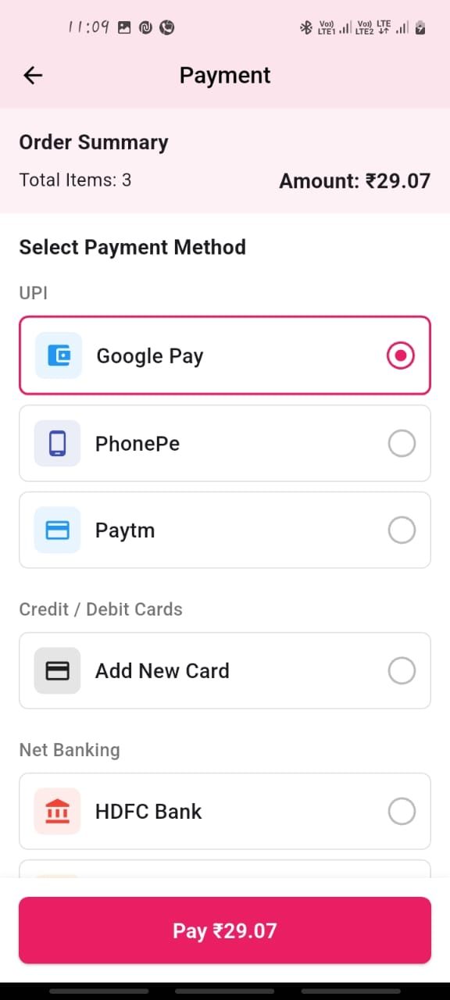

# shopping_cart_app

# Shopping Cart App
A Flutter-based mobile application that provides a seamless shopping experience with product browsing, 
cart management, and checkout functionality.

# Overview
This Shopping Cart App is built using Flutter with Riverpod for state management. It fetches product data 
from the DummyJSON API and allows users to browse products, add them to a cart, and manage their 
shopping experience.

# Features
Product Catalog: Browse through a paginated list of products.
Product Details: View product information, including price, discount, and description.
Shopping Cart: Add products to cart, update quantities, and remove items.
Price Calculation: Automatic calculation of discounted prices and cart totals.
Payment Method Page: Choose from multiple payment options such as credit/debit cards, UPI, and PayPal. 
                     Provides secure payment options, allows users to enter card details, and confirm transactions.
Order Summary: Displays a breakdown of selected products, pricing, and applied discounts before proceeding 
               to payment.
Responsive UI: Works on various screen sizes and orientations.

# Dependencies : The app uses the following dependencies:
Flutter: Framework for building the UI.
Riverpod: State management solution.
HTTP: Fetch product data from the DummyJSON API.
Cached Network Image: Efficient image loading and caching.
Intl: Internationalization and formatting utilities.
Badges: Displays notification badges for UI elements.

# Screenshots

